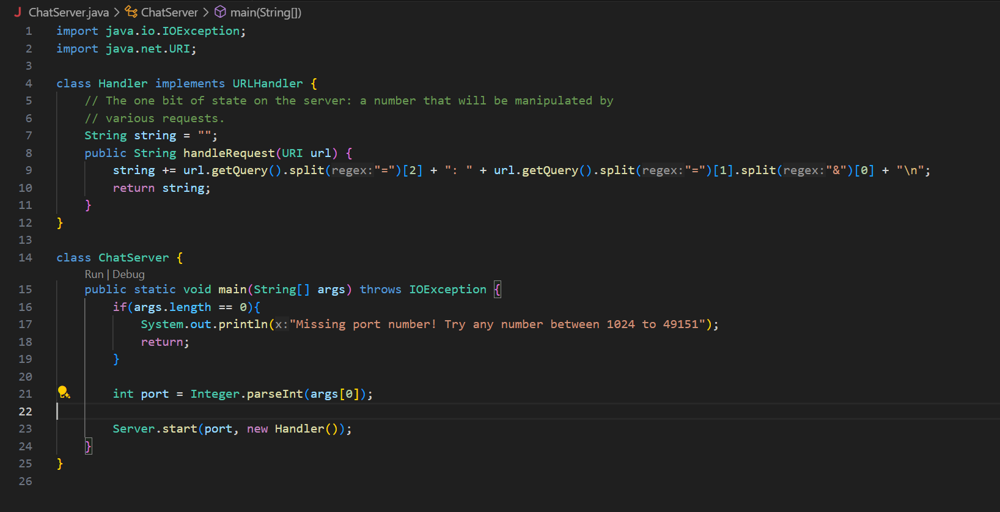
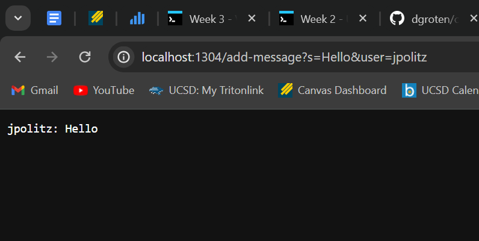
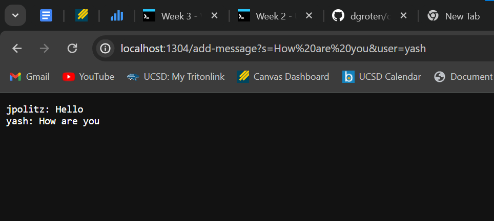
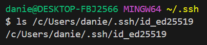
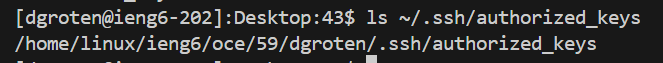
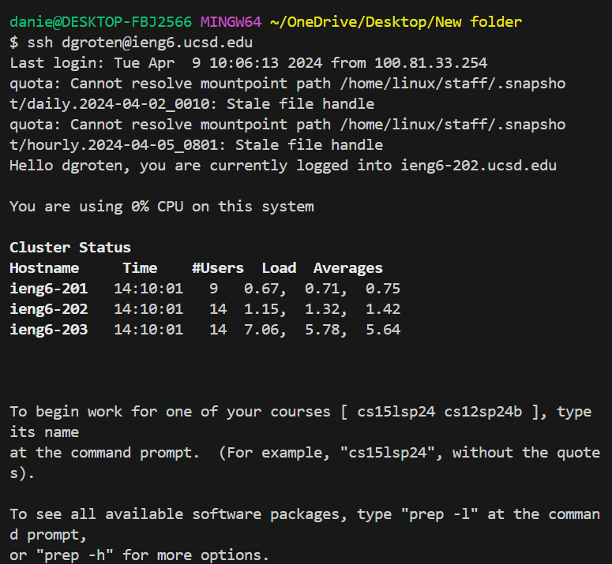

# Lab Report 2

## Daniel J. Groten

### Part 1

The methods `handleRequest`, `getQuery`, and `split` are called.

The method `handleRequest` takes the argument `http://localhost:1304/add-message?s=Hello&user=jpolitz` of type `URI`, the method `getQuery` takes no arguments, and the method `split` takes the argument `=` of type `string`.

The value of the field `url` is `http://localhost:1304/add-message?s=Hello&user=jpolitz` of type `URI`.

The value of the field `string` before `handleRequest` is called is an empty string and the value of the field `string` after `handleRequest` is called is the string `jpolitz: Hello\n`.

Initially, the field `string` is empty but then my code finds the query in the URL using the `getQuery` method and separates the user and the message from the query using the `split` method before adding the user and message to the field `string`.

Then, the updated `string` is returned and appears on the website as the string `jpolitz: Hello\n` (the \n isn't visible on the website because it represents the newline character).

The methods `handleRequest`, `getQuery`, and `split` are called.

The method `handleRequest` takes the argument `http://localhost:1304/add-message?s=How are you&user=yash` of type `URI`, the method `getQuery` takes no arguments, and the method `split` takes the argument `=` of type `string`.

The value of the field `url` is `http://localhost:1304/add-message?s=How are you&user=yash` of type `URI`.

The value of the field `string` before `handleRequest` is called is `jpolitz: Hello\n` and the value of the field `string` after `handleRequest` is called is the string `jpolitz: Hello\nyash: How are you\n`.

Initially, the field `string` is `jpolitz: Hello\n` but then my code finds the query in the URL using the `getQuery` method and separates the user and the message from the query using the `split` method before adding the user and message to the field `string`.

Then, the updated `string` is returned and appears on the website as the string `jpolitz: Hello\nyash: How are you\n` (the \n isn't visible on the website because it represents the newline character).

### Part 2

### Part 3

It seems obvious as I'm saying this now, but it never really clicked with me before that everything we do online occurs somewhere on a physical computer.

I used to think of the internet as a cloud, something non-solid that is just floating in the air, but in reality every time we access a server on the internet we are connecting to a physical piece of technology.
