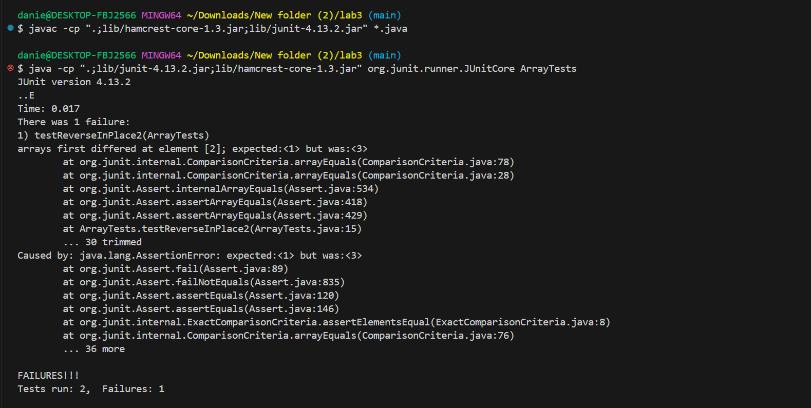

# Lab Report 3

## By Daniel J. Groten

### Part 1

The code for the method `reverseInPlace` in the class `ArrayExamples` is below:

```
static void reverseInPlace(int[] arr) {
  for(int i = 0; i < arr.length; i += 1) {
    arr[i] = arr[arr.length - i - 1];
  }
}
```

The failure inducing input for the buggy method `reverseInPlace` is the integer array `{3, 2, 1}`.

```
@Test
public void testReverseInPlace2() {
  int[] input1 = {1, 2, 3};
  ArrayExamples.reverseInPlace(input1);
  assertArrayEquals(new int[]{3, 2, 1}, input1);
}
```

An input that doesn't induce failure is `{1}`.

```
@Test
public void testReverseInPlace1() {
  int[] input1 = {1};
  ArrayExamples.reverseInPlace(input1);
  assertArrayEquals(new int[]{1}, input1);
}
```

The image below shows the output of running the two tests I described above.



Here is the original code for the buggy method `reverseInPlace`:

```
static void reverseInPlace(int[] arr) {
  for(int i = 0; i < arr.length; i += 1) {
    arr[i] = arr[arr.length - i - 1];
  }
}
```

Here is the new code for my debugged version of the method `reverseInPlace`:

```
static void reverseInPlace(int[] arr) {
  int[] newArray = new int[arr.length];
  for(int i = 0; i < arr.length; i += 1) {
    newArray[i] = arr[arr.length - i - 1];
  }
  for(int i = 0; i < arr.length; i += 1) {
    arr[i] = newArray[i];
  }
}
```

reverseInPlace failed with the array {1, 2, 3}, returning {3, 2, 3} instead of {3, 2, 1}.
This is because it tries to shuffle around the elements in the original array but when it changes the first element of the array it loses that data, so when it gets to the last element and has to move the first element to it the data stored in the first element is the data that used to be stored in the last element.
I corrected this by creating a new array, reversing the new array while referencing the original array, copying all the elements of the new array into the original array, and then returning the original array.

### Part 2

I am going to be exploring alternate options for the `find` command.

#### The first option is `-size`.

Example 1:

```
$ find -size +250k
./911report/chapter-13.4.txt
./911report/chapter-13.5.txt
./911report/chapter-3.txt
./government/Gen_Account_Office/d01591sp.txt
./government/Gen_Account_Office/Statements_Feb28-1997_volume.txt
```

This command locates all of the files in the current directory that are greater than 250 kilobytes.
This could be incredibly useful for clearing space in your computer as you could use this command to locate the largest files that are taking up the most space.

Example 2:

```
$ find -size -2k
.
./911report
./biomed
./government
./government/About_LSC
./government/Alcohol_Problems
./government/Env_Prot_Agen
./government/Gen_Account_Office
./government/Media
./government/Post_Rate_Comm
./plos
./plos/pmed.0020191.txt
./plos/pmed.0020226.txt
```

This command locates all of the files in the current directory that are lesser than 2 kilobytes.
This could be useful for finding a specific file that you know is very small but you don't know where it is located.

#### The second option is `-type`.

Example 1:

```
$ find -type d
.
./911report
./biomed
./government
./government/About_LSC
./government/Alcohol_Problems
./government/Env_Prot_Agen
./government/Gen_Account_Office
./government/Media
./government/Post_Rate_Comm
./plos
```

This command locates all of the directories in the current directory.
This could be useful if you have to find a very specific directory in a long list of directories, especially if there are directories within other directories.

Example 2:

```
$ find -type d -name Media
./government/Media
```

This command locates the directory with the name `Media` by utilising the additional option `-name`.
This could be useful for finding the location of a specific directory located somewhere in a complex filesystem composed of multiple directories within directories.

#### The third option is `-user`.

Example 1:

```
$ find -type d -user danie
.
./911report
./biomed
./government
./government/About_LSC
./government/Alcohol_Problems
./government/Env_Prot_Agen
./government/Gen_Account_Office
./government/Media
./government/Post_Rate_Comm
./plos
```

This command locates all of the directories belonging to the user `danie`.
This could be useful for locating directories in a filesystem shared by two users.

Example 2:

```
$ find -user mario
find: ‘mario’ is not the name of a known user
```

This command searches for a user of the name `mario`.
This could be useful for checking to see if a user with the same name already exists in the filesystem before adding a new user.

#### The fourth option is `-empty`.

Example 1:

```
$ find -type f -empty

```
(no output)

This command locates empty files by utilising the additional option `-type`.
This could be useful for cleaning up a messy/cluttered filesystem that contains empty files.

Example 2:

```
$ find -type d -empty

```
(no output)

This command locates empty directories by utilising the additional option `-type`.
This could be useful for checking to see if a directory was fully cleared properly.

All of my research for every option in Part 2 was done using this web page: https://snapshooter.com/learn/linux/find
