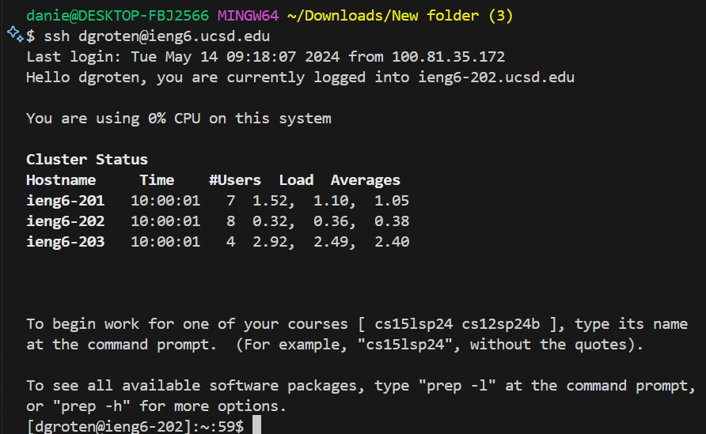
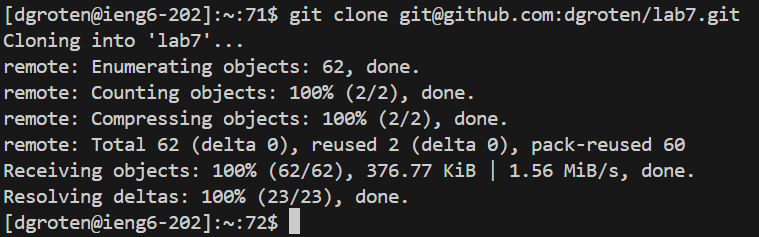
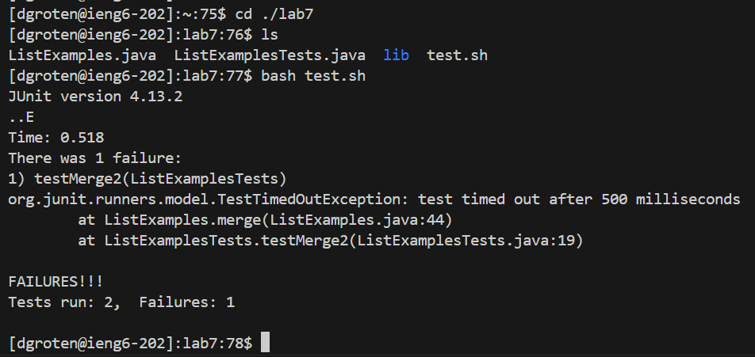
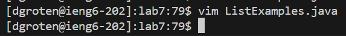
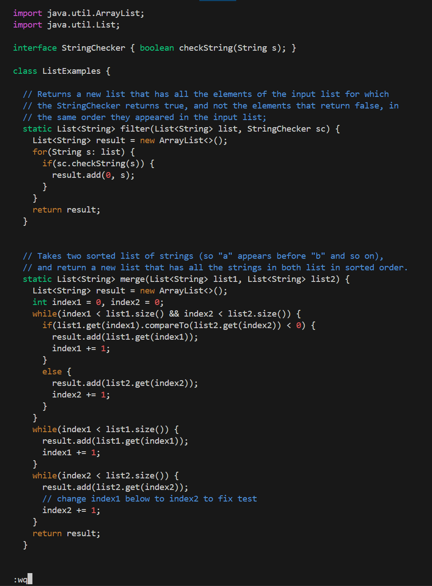
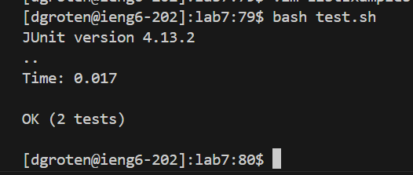
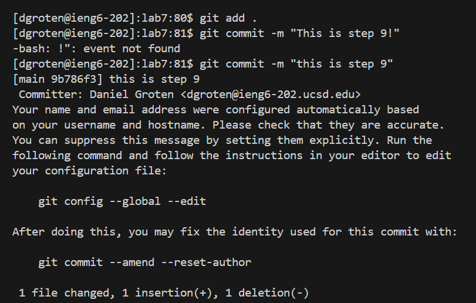

# Lab Report 4

## By Daniel J. Groten

### Step 4
-take a screenshot
-write down every key press
-sumarize every command and explain what every key press did

Key Presses: `ssh dgroten@ieng6.ucsd.edu<enter>`

Explanation: The `ssh` command connects me to a secure shell. The command requires the input of the secure shell I want to connect to.
I use the domain `ieng6.ucsd.edu` to connect to the secure shell the lab told me to connect to. I also use the username `dgroten` so that the secure shell knows it is me logging in to my account on the server.
Finally, I used `<enter>` to execute the line.

### Step 5

Key Presses: `git clone <ctrl>v<enter>`

Explanation: The `git clone` command allows me to clone a folder from GitHub into my working directory so I can work in it. For the input, it requires a link to the folder I want to clone.
I copied the link `git@github.com:dgroten/lab7.git` of my forked `lab7` folder in GitHub and pasted it into my terminal using `<ctrl>v`.
Finally, I used `<enter>` to execute the line.

### Step 6

Key Presses: `cd ./lab7<enter>ls<enter>bash test.sh<enter>`

Explanation: The `cd` command allows me to change my working directory to the given directory `./lab7` which is the folder `lab7` inside of my current working directory.
I use the `<enter>` key to execute the line. Then, I use the `ls` command to view the files and folders inside `lab7`. I use the `<enter>` key to execute the line.
The `bash` command allows me to run a `.sh` file, which contains multiple lines of commands. It requires the input of a `.sh` file, which in this case is `test.sh`.
Finally, I used `<enter>` to execute the line which runs the `test.sh` file, and the file runs the tests.

### Step 7

Key Presses: `vim ListExamples.java<enter>43j12li<backspace>2<escape>:wq`

Explanation: The `vim` command opens the input file so it can be edited in the terminal using `vim`. I pass it the input file `ListExamples.java` which contains the bug and I use `<enter>` to execute the line.
Then, I type `43j` which repeats the `j` key 43 times. Since the `j` key acts as a down arrow, this allows me to go from line 1 to line 44, where the bug is, using only three key presses.
I use a similar strategy to navigate horizontally. I type `12l` which moves left 12 times. After, I type `i` which allows me to type inside of the file without using vim commands (I can edit the file like a normal document).
In the insert mode, I use `<backspace>` to delete the incorrect `1` character and then I use the `2` key to add the correct `2` character after `index`. Finally, I press `<escape>` to exit insert mode and I use `:wq` which writes my changes to the file and quits vim.

### Step 8

Key Presses: `<up><up><enter>`

Explanation: I press the up-arrow key two times in order to go back to the previous time where I ran `bash test.sh` in the command line. Then, I used `<enter>` to execute the file which runs the tests.

### Step 9

*I accidentally made a mistake where I used an exclamation mark in my git commit message which caused the terminal to throw an error. In my key presses and explanation I will ignore this error because it was unintended and not a necessary part of my process.

Key Presses: `git add .<enter>git commit -m "this is step 9"<enter>`

Explanation: 
