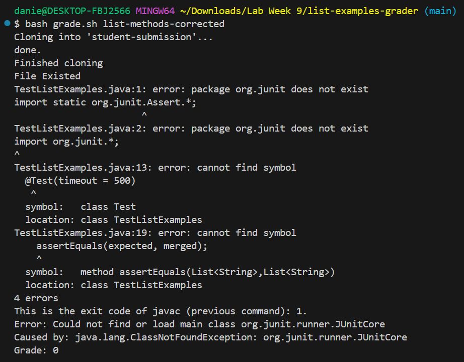

# Lab Report 5

## By Daniel J. Groten

### Part 1

#### Step 1

Student: I am having trouble with my `grade.sh` script. I don't know what the problem is because my friend tested my script and said it works fine but when I test it on my computer it doesn't work.
I know the problem is not in `TestListExamples.java` because I tried making a fresh clone of the original repository and it still doesn't work. The only file I changed is `grade.sh` so it must be causing the problem.
I have added my script and attached a picture of the error below.



```
CPATH='.:lib/hamcrest-core-1.3.jar:lib/junit-4.13.2.jar'

rm -rf student-submission
rm -rf grading-area

mkdir grading-area

# Step 1 - Clone the student repository
git clone $1 student-submission
echo 'Finished cloning'

# Step 2 - Check that the student code contains ListExampls.java

if [[ -f student-submission/ListExamples.java ]]; then
    echo "File Existed"
else
    echo "ListExamples.java does not exist"
    echo "Grade: 0"
    exit 1
fi

# Step 3 - Put all of the relevant files in the grading-area directory

cp student-submission/ListExamples.java  TestListExamples.java grading-area
cp -r lib grading-area

# Step 4 - Compile

cd grading-area
javac -cp "$CPATH" ListExamples.java TestListExamples.java

echo "This is the exit code of javac (previous command): $?."

# Step 5 - Run the tests

test=$(java -cp "$CPATH" org.junit.runner.JUnitCore TestListExamples)

# Step 6 - Report the grade

if [[ "$test" == *"OK"* ]]; then
    echo "Grade: 100"
else
    echo "Grade: 0"
fi

echo "$test"

# Draw a picture/take notes on the directory structure that's set up after
# getting to this point

# Then, add here code to compile and run, and do any post-processing of the
# tests
```

#### Step 2

TA: It looks like the error may have something to do with your classpath. I would suggest researching how classpath notation changes for different operating systems.

#### Step 3

The student did some research on classpath notation and found that it changes based on if the computer is running on a Windows operating system or a Linux operating system.
He realized that his friend has a Linux computer while the student has a Windows computer, which explains why the script worked for the student's friend but not the student.
He then changed the first line `CPATH='.:lib/hamcrest-core-1.3.jar:lib/junit-4.13.2.jar'` to `CPATH='.;lib/hamcrest-core-1.3.jar;lib/junit-4.13.2.jar'`, replacing the colons with semicolons.
He ran the script again and the output to his terminal is attached below.


#### Step 4


All of the files are identical to the ones found in the Week 6 Lab repository found here `https://github.com/ucsd-cse15l-s24/list-examples-grader.git`, with two exceptions.

Firstly, the `ListExamples.java` file in the `list-methods-corrected` I obtained from the repository `https://github.com/ucsd-cse15l-f22/list-methods-corrected` and its contents are as follows:

```
import java.util.ArrayList;
import java.util.List;

interface StringChecker { boolean checkString(String s); }

class ListExamples {

  // Returns a new list that has all the elements of the input list for which
  // the StringChecker returns true, and not the elements that return false, in
  // the same order they appeared in the input list;
  static List<String> filter(List<String> list, StringChecker sc) {
    List<String> result = new ArrayList<>();
    for(String s: list) {
      if(sc.checkString(s)) {
        result.add(s);
      }
    }
    return result;
  }


  // Takes two sorted list of strings (so "a" appears before "b" and so on),
  // and return a new list that has all the strings in both list in sorted order.
  static List<String> merge(List<String> list1, List<String> list2) {
    List<String> result = new ArrayList<>();
    int index1 = 0, index2 = 0;
    while(index1 < list1.size() && index2 < list2.size()) {
      if(list1.get(index1).compareTo(list2.get(index2)) < 0) {
        result.add(list1.get(index1));
        index1 += 1;
      }
      else {
        result.add(list2.get(index2));
        index2 += 1;
      }
    }
    while(index1 < list1.size()) {
      result.add(list1.get(index1));
      index1 += 1;
    }
    while(index2 < list2.size()) {
      result.add(list2.get(index2));
      index2 += 1;
    }
    return result;
  }


}
```

Secondly, the `grade.sh` file before I fixed the bug is as follows:

```
CPATH='.:lib/hamcrest-core-1.3.jar:lib/junit-4.13.2.jar'

rm -rf student-submission
rm -rf grading-area

mkdir grading-area

# Step 1 - Clone the student repository
git clone $1 student-submission
echo 'Finished cloning'

# Step 2 - Check that the student code contains ListExampls.java

if [[ -f student-submission/ListExamples.java ]]; then
    echo "File Existed"
else
    echo "ListExamples.java does not exist"
    echo "Grade: 0"
    exit 1
fi

# Step 3 - Put all of the relevant files in the grading-area directory

cp student-submission/ListExamples.java  TestListExamples.java grading-area
cp -r lib grading-area

# Step 4 - Compile

cd grading-area
javac -cp "$CPATH" ListExamples.java TestListExamples.java

echo "This is the exit code of javac (previous command): $?."

# Step 5 - Run the tests

test=$(java -cp "$CPATH" org.junit.runner.JUnitCore TestListExamples)

# Step 6 - Report the grade

if [[ "$test" == *"OK"* ]]; then
    echo "Grade: 100"
else
    echo "Grade: 0"
fi

echo "$test"

# Draw a picture/take notes on the directory structure that's set up after
# getting to this point

# Then, add here code to compile and run, and do any post-processing of the
# tests
```

The command that triggered the bug was `bash grade.sh list-methods-corrected`

To fix the bug I changed the first line of `grade.sh` from `CPATH='.:lib/hamcrest-core-1.3.jar:lib/junit-4.13.2.jar'` to `CPATH='.;lib/hamcrest-core-1.3.jar;lib/junit-4.13.2.jar'`, replacing the colons with semicolons.
The bug was due to the fact that I was running the file on a Windows computer but my classpath notation was formatted for a Linux computer.

### Part 2

I think that pipes are really interesting. It's cool how you can take any output from a previous command and use it as input for the next command. Pipes are an important tool in being able to automate a command process.
Writing commands can sometimes be very specific, but pipes allow for more freedom by utilizing a generalized input as opposed to, for example, requiring a file with a specific name.
